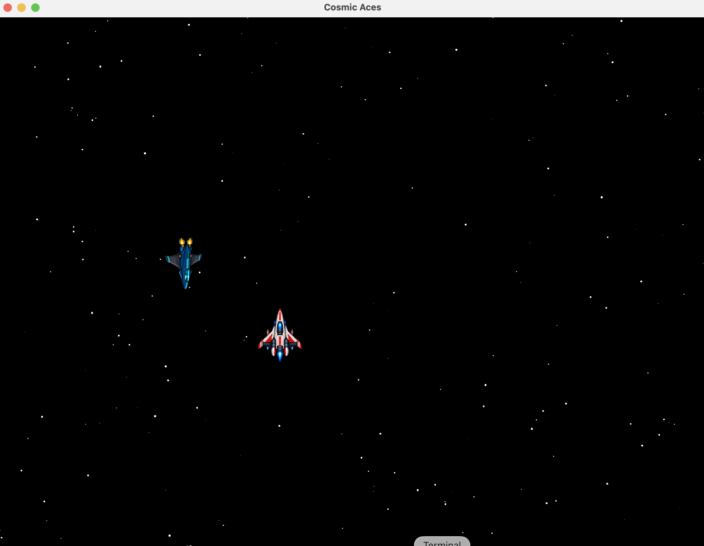

# Cosmic Aces

**Un arcade espacial de desplazamiento vertical**, creado con Java y LibGDX. Pilota a Astra, esquiva a los Vesper Raiders y cruza un campo de estrellas en una aventura inspirada en los clásicos *shoot ’em up*.



> El proyecto está en desarrollo. La captura muestra la fase jugable actual; las mecánicas y fases se irán ampliando.

## Estado actual

- Pantalla de bienvenida; pulsa **Y** para empezar.
- Primera fase jugable con Astra y movimiento en las cuatro direcciones.
- Acelera manteniendo **↑**; la nave cambia de pose al virar.
- Campo de estrellas y Vesper Raiders que aparecen desde la parte superior.
- Recorrido de 60 segundos. Al terminar, pulsa **Espacio** para volver al inicio.
- Pulsa **Esc** para abandonar la partida y volver al inicio.

El disparo, nuevas fases, la pantalla de fin de partida y el hall of fame todavía no están implementados.

## Requisitos

- JDK 22
- Maven 3.x

El juego usa LibGDX 1.12.1 con LWJGL3 para escritorio. La resolución virtual es de 800 × 600 y la ventana puede redimensionarse.

## Ejecutar

Desde la raíz del proyecto:

```bash
mvn compile exec:exec
```

En macOS, Maven aplica `-XstartOnFirstThread` al iniciar la aplicación.

## Estructura del proyecto

El código Java está organizado por responsabilidades:

- `boot`: punto de entrada y configuración de escritorio.
- `application`: coordinación de la partida y controladores de fase.
- `domain`: estado, reglas, naves, enemigos y elementos del escenario.
- `infrastructure`: pantallas, eventos y composición de recursos LibGDX.

La guía [docs/architecture.md](docs/architecture.md) explica cómo ubicar nuevas clases y describe las clases principales y sus métodos. Las convenciones para agentes están en [AGENTS.md](AGENTS.md).

## Dirección futura

El desarrollo contempla ampliar las fases y las mecánicas del juego. También se considera incorporar funciones en línea mediante WebSockets, como partidas multijugador o rankings. Si se implementa esa parte, el servidor será un servicio independiente; Spring Boot no forma parte del cliente actual.
